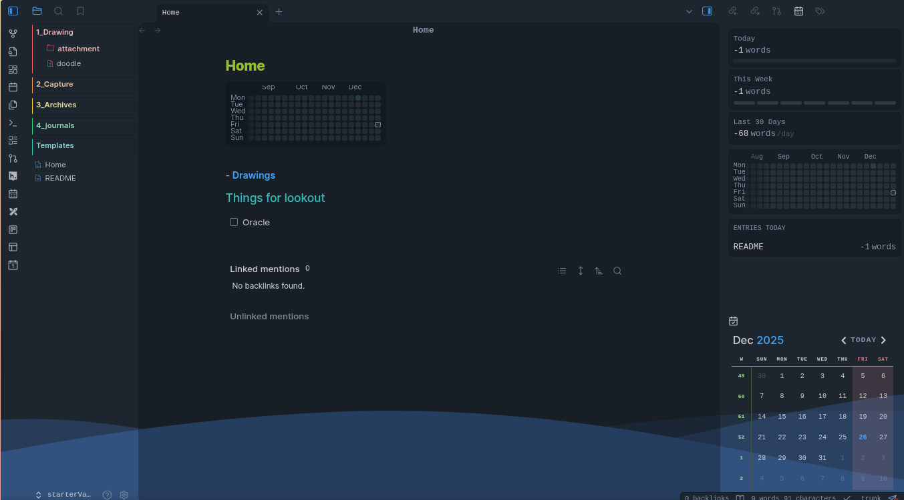
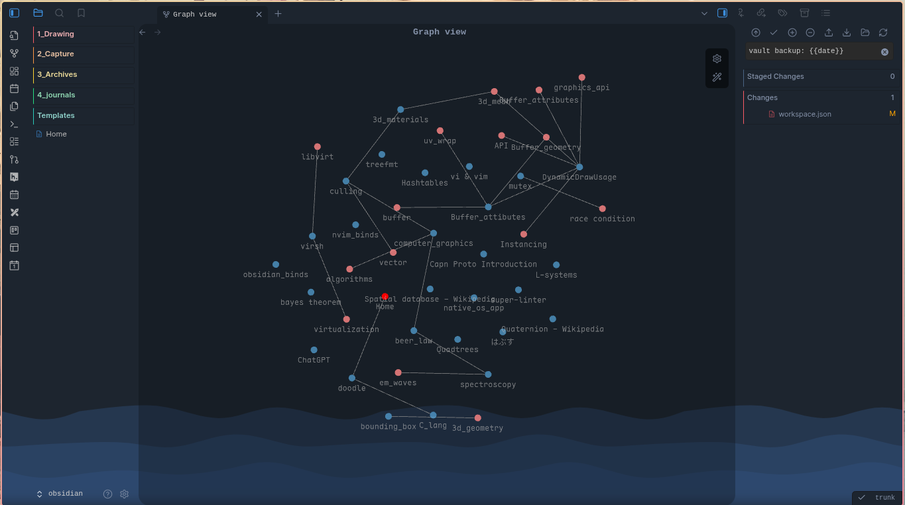

A minimal, opinionated Obsidian vault designed for **rhythm, clarity, and long-term thinking**.

This repository is not a collection of notes.
It is a **structure for thinking**.

---



## Philosophy

StarterVault follows a simple lifecycle:

> Capture → Shape → Reflect → Archive

Each folder exists to reduce friction at a specific stage of thought, not to enforce complexity.

The goal is sustainability over novelty.

---

## Folder Structure

```

.
├── Home.md
├── Templates/
├── 1_Drawing/
├── 2_Capture/
├── 3_Archives/
├── 4_journals/
├── .obsidian/
└── .gitignore

```

### `Home.md`
The entry point to the vault.
Acts as a dashboard, index, and grounding note.

Suggested use:
- Daily orientation
- Open threads
- Important links
- Navigation hub

---

### `2_Capture/`
The inbox.

Everything unprocessed goes here:
- Fleeting ideas
- Quick notes
- Quotes
- Screenshots
- Raw thoughts

No structure required. Speed over order.

---

* **Graph **




### `1_Drawing/`
The thinking space.

Used for:
- Concept maps
- Visual notes
- Excalidraw files
- Systems, models, and relationships

This is where ideas are **shaped**, not stored.

---

### `4_journals/`
Time-bound writing.

Used for:
- Daily logs
- Reflections
- Personal tracking
- State-of-mind snapshots

Entries are chronological and lightly structured.

---

### `3_Archives/`
Cold storage.

Only notes that are:
- Finished
- Dormant
- No longer active

Nothing here should demand attention.

---

### `Templates/`
Reusable patterns for notes.

Examples:
- Daily journal
- Capture note
- Concept note
- Review note

Templates reduce friction and decision fatigue.

---

### `.keep-the-rhythm/`
A space for maintaining consistency.

Intended for:
- Habit systems
- Cadence rules
- Checklists
- Meta-notes about workflow

This folder exists to protect momentum.

---

## Usage

1. Open the vault in **Obsidian**
2. Start every session from `Home.md`
3. Capture freely
4. Shape selectively
5. Archive deliberately

No plugins are required, but the vault is compatible with visual and journaling workflows.

---

## Version Control Notes

- `.obsidian` is tracked intentionally
- Personal or machine-specific files should be excluded via `.gitignore`
- This repo is meant to evolve slowly

---

## License

This vault structure is free to use, modify, and adapt for personal or professional knowledge systems.

Build gently. Think deeply. Keep the rhythm.
```
